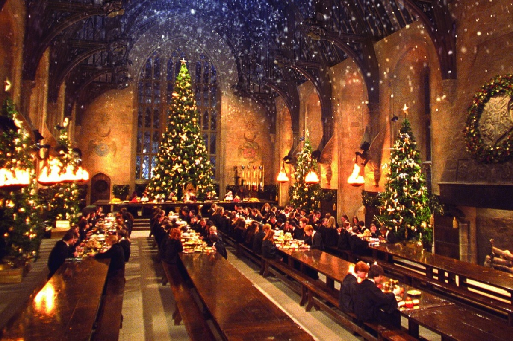

A saga Harry Potter é ambientada em um mundo mágico que é tão detalhado e complexo que parece quase real. Um dos elementos mais marcantes deste universo é a Escola de Magia e Bruxaria de Hogwarts, um castelo mágico escondido nas montanhas da Escócia. Hogwarts é um local onde bruxos e bruxas aprendem a controlar e aperfeiçoar suas habilidades mágicas, e é também o cenário para muitas das aventuras de Harry e seus amigos.

Além de Hogwarts, o mundo de Harry Potter é povoado por uma grande variedade de personagens e criaturas mágicas. Há os elfos domésticos, como Dobby, que são escravizados por bruxos e bruxas, e os gigantes, que são seres gigantescos que vivem nas montanhas. Há também os dementadores, que são criaturas das trevas que sugam a felicidade das pessoas, e os animais mágicos, como as fênixes e os dragões.

A magia é um elemento central neste universo, e é apresentada de várias formas. Há feitiços, que são palavras mágicas que fazem coisas acontecerem, e poções, que são misturas de ingredientes mágicos que têm efeitos específicos. Há também objetos mágicos, como a varinha mágica, que é uma ferramenta essencial para um bruxo ou bruxa, e a capa da invisibilidade, que torna a pessoa que a usa invisível.