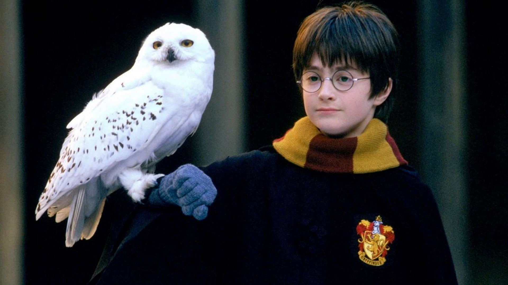

A saga Harry Potter aborda uma série de temas universais que são relevantes para pessoas de todas as idades e origens. Um dos temas mais importantes é a amizade e a lealdade. Harry, Rony e Hermione são amigos muito próximos, e estão sempre lá um para o outro, mesmo quando enfrentam desafios difíceis. Outro tema importante é a luta entre o bem e o mal. Harry e seus amigos lutam contra Voldemort e seus seguidores, que querem dominar o mundo mágico e subjugar os trouxas. Eles enfrentam muitos obstáculos, mas nunca desistem de lutar pelo que é certo.

A saga Harry Potter também explora a jornada do herói, que é um tema clássico da literatura. Harry é um herói relutante, que não queria ser famoso ou ter a responsabilidade de lutar contra Voldemort. Mas ele aceita seu destino e se torna um grande líder e um símbolo de esperança para o mundo mágico. E, finalmente, a saga Harry Potter também trata da importância da escolha pessoal e do livre-arbítrio. Harry e seus amigos fazem muitas escolhas difíceis ao longo da série, e cada uma delas tem consequências significativas para o mundo mágico.