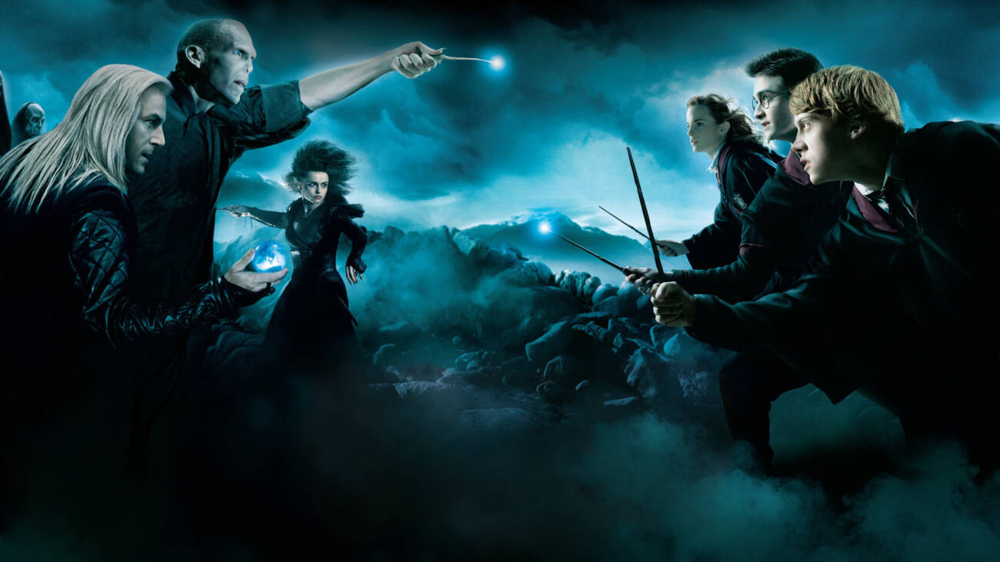

A saga Harry Potter foi adaptada para o cinema em uma série de filmes que foram muito bem-sucedidos. Os filmes foram dirigidos por David Yates e estrelados por Daniel Radcliffe, Emma Watson e Rupert Grint. Eles foram muito bem recebidos pela crítica e pelo público, e arrecadaram bilhões de dólares em todo o mundo. Além disso, a saga Harry Potter também foi expandida através de spin-offs, como "Animais Fantásticos e Onde Habitam", que exploram o mundo mágico de Harry Potter de novas maneiras.