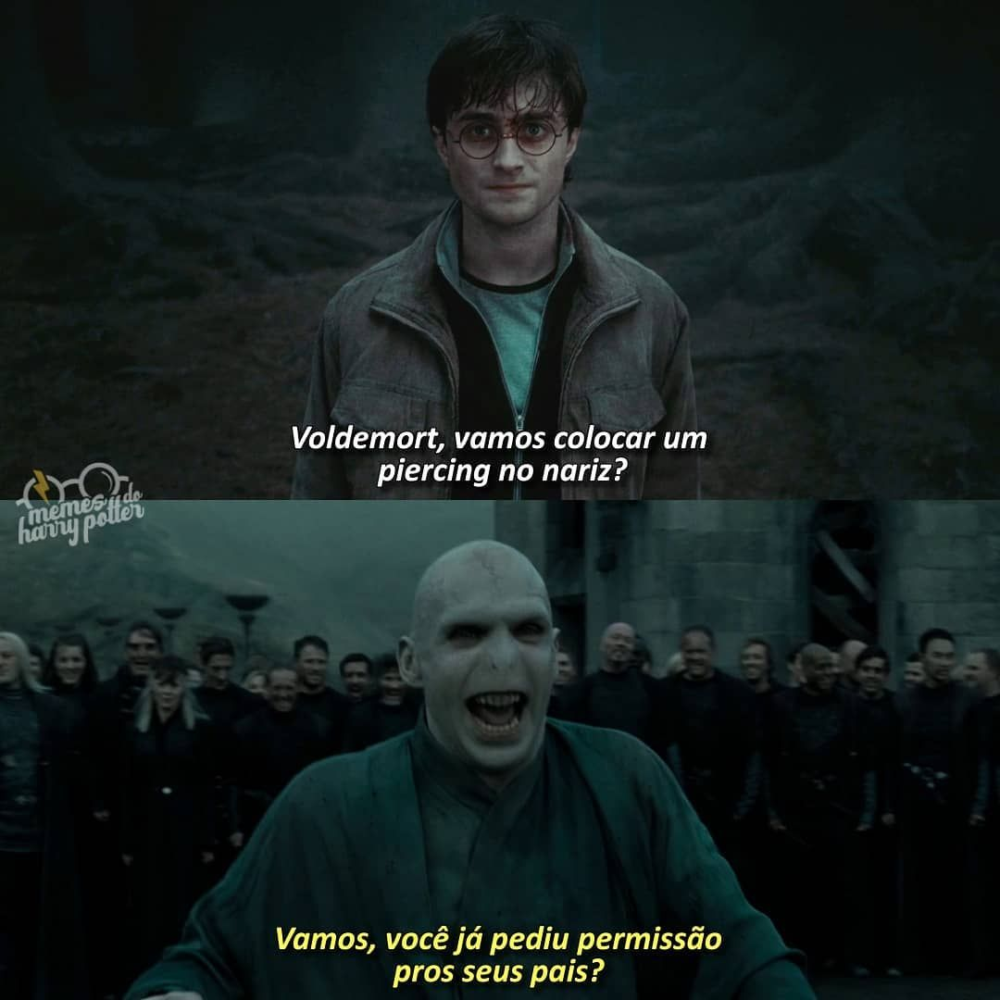

A saga Harry Potter tem uma comunidade global de fãs devotos que se reúnem em eventos e convenções dedicados ao mundo de Harry Potter. Esses eventos são uma oportunidade para os fãs se encontrarem, discutirem suas teorias favoritas e compartilharem sua paixão pela série. Além disso, os fãs de Harry Potter também são muito ativos nas redes sociais, onde criam e compartilham memes, fan art e fan fiction. Eles também produzem conteúdo original, como podcasts e vídeos no YouTube, que exploram diferentes aspectos do mundo de Harry Potter.