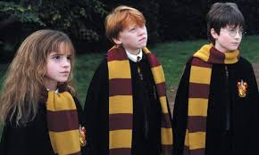

A saga Harry Potter é povoada por personagens memoráveis e complexos, cada um com suas próprias características e motivações. Harry Potter, o protagonista da série, é um exemplo clássico de um herói relutante. Ele não queria ser famoso ou ter a responsabilidade de lutar contra Voldemort, mas aceita seu destino e se torna um grande líder e um símbolo de esperança para o mundo mágico.

Hermione Granger é outro personagem importante na série. Ela é uma bruxa extremamente inteligente e corajosa, que usa sua inteligência e habilidades mágicas para ajudar Harry e seus amigos a enfrentar os desafios que enfrentam. E Rony Weasley é um personagem que traz humor e lealdade à série. Ele é o melhor amigo de Harry e Hermione, e está sempre lá para ajudá-los, mesmo quando as coisas ficam difíceis.