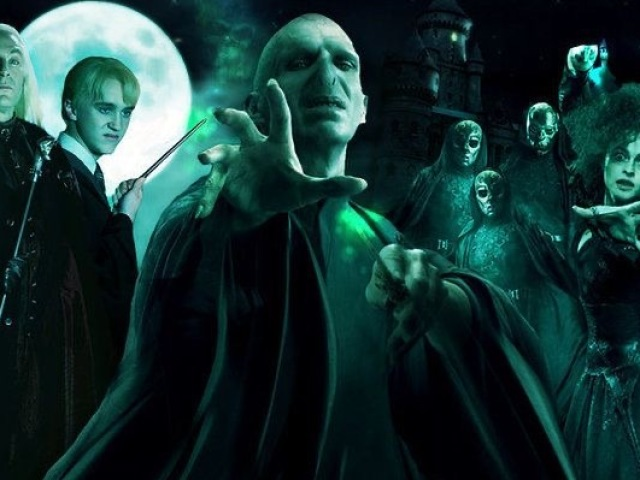

Além dos heróis, a saga Harry Potter também apresenta uma série de vilões inesquecíveis, cada um com suas próprias motivações e características únicas. Voldemort, por exemplo, é o arquétipo do mal encarnado. Ele é um bruxo poderoso e ambicioso que quer dominar o mundo mágico e subjugar os trouxas. Ele é cruel e impiedoso, e fará qualquer coisa para alcançar seus objetivos.

Severo Snape é outro vilão importante na série. Ele é um bruxo inteligente e habilidoso que trabalha como professor em Hogwarts. Ele é um personagem complexo, com motivações ambíguas e uma história de vida trágica. E Dolores Umbridge é uma bruxa autoritária e intolerante que trabalha como professora em Hogwarts. Ela é uma personagem odiosa que faz a vida de Harry e seus amigos um inferno, mas ela também é uma personagem interessante e bem desenvolvida.